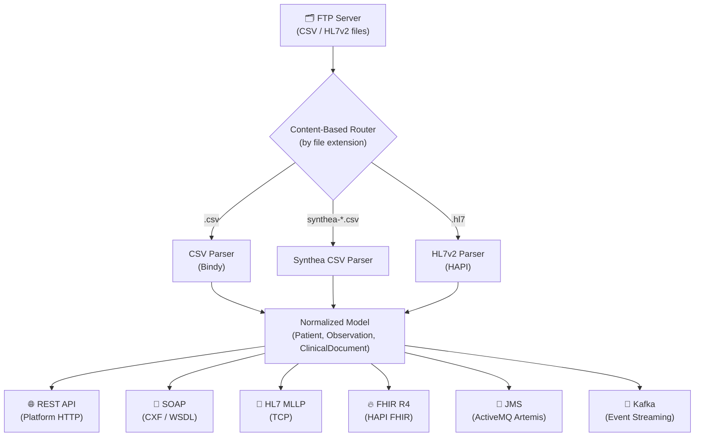
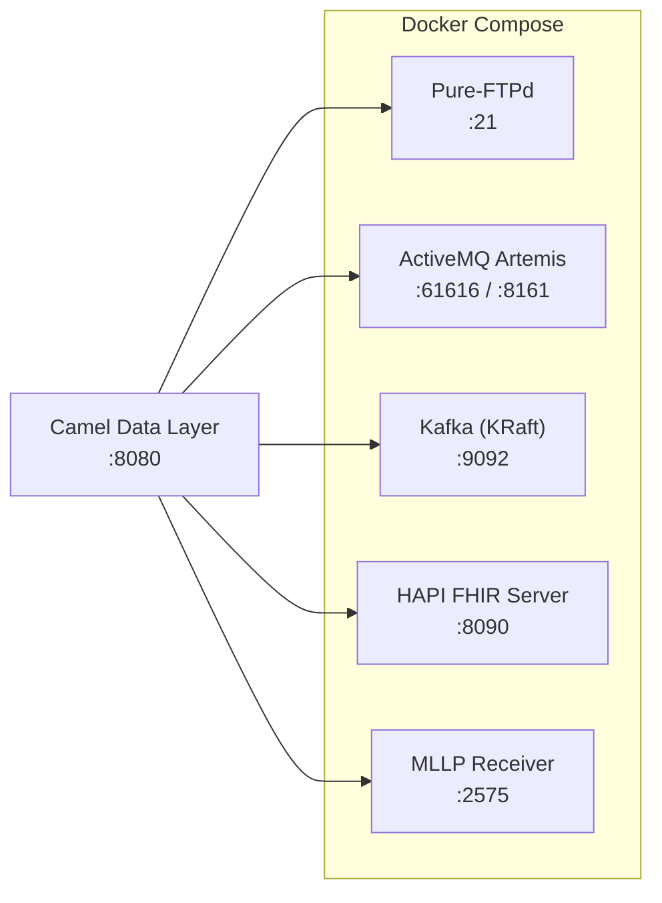
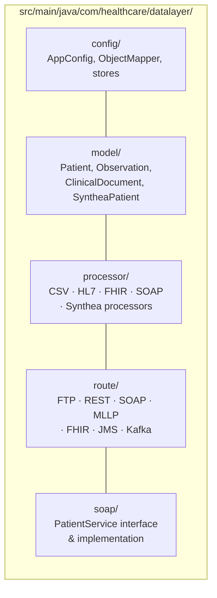

# Camel Data Layer — Healthcare Flat-File Integration Hub

A Java 21 / Quarkus project using Apache Camel to ingest flat files (CSV, HL7v2) from an FTP server and route them to multiple healthcare-standard output connectors.

## Architecture



## Infrastructure



## Output Connectors

| Connector | Protocol | Endpoint |
|-----------|----------|----------|
| REST API | HTTP/JSON | `GET /api/patients`, `GET /api/observations`, `GET /api/health` |
| SOAP | XML/WSDL | `/soap/PatientService` — `getPatient`, `searchPatients`, `getAllPatients` |
| HL7 MLLP | TCP | Outbound HL7v2 messages to `mllp://host:2575` |
| FHIR R4 | HTTP/JSON | POST FHIR Bundle to HAPI FHIR Server |
| JMS | AMQP | `queue.patients`, `topic.clinical-events` on ActiveMQ Artemis |
| Kafka | TCP | `healthcare.patients.ingested` topic |

## Prerequisites

- Java 21+
- Maven 3.9+
- Docker & Docker Compose (for infrastructure)

## Quick Start

### 1. Start infrastructure

```bash
docker-compose up -d
```

This starts:
- **FTP Server** (Pure-FTPd) on port 21
- **ActiveMQ Artemis** on port 61616 (console: http://localhost:8161)
- **Kafka** (KRaft) on port 9092
- **HAPI FHIR Server** on port 8090 (UI: http://localhost:8090)
- **MLLP Receiver** (socat) on port 2575

### 2. Generate synthetic data with Synthea

Uses [Synthea](https://github.com/synthetichealth/synthea) to create realistic synthetic patients:

```bash
chmod +x scripts/*.sh

# Generate 20 patients (default)
./scripts/generate-synthea-data.sh

# Or generate 100 patients in Texas
./scripts/generate-synthea-data.sh 100 Texas
```

This downloads Synthea, generates CSV/HL7/FHIR data, and places it in `sample-data/`.

### 3. Build & run the application

```bash
mvn quarkus:dev
```

> **Note:** 10 sample patients from `sample-data/csv/patients.csv` are loaded automatically on startup — no FTP or docker-compose needed to see data in the REST/SOAP endpoints.

### 4. Seed the FTP server with additional data

```bash
# Upload Synthea-generated files
./scripts/seed-ftp.sh

# Or upload individual files manually
curl -T sample-data/csv/patients.csv ftp://localhost/inbox/ --user healthcare:healthcare123
curl -T sample-data/hl7/adt-a01.hl7 ftp://localhost/inbox/ --user healthcare:healthcare123
```

## Testing the Output Connectors

After starting the application with `mvn quarkus:dev`, you can verify each connector:

### REST API

```bash
# Health check — shows counts for all in-memory stores
curl -s http://localhost:8080/api/health | python3 -m json.tool
# → {"status": "UP", "patients": 10, "observations": 0, "documents": 1}

# List all patients
curl -s http://localhost:8080/api/patients | python3 -m json.tool

# Get a single patient by ID
curl -s http://localhost:8080/api/patients/P001 | python3 -m json.tool

# Patient not found → 404
curl -s -w "\nHTTP %{http_code}\n" http://localhost:8080/api/patients/UNKNOWN

# List ingested documents
curl -s http://localhost:8080/api/documents | python3 -m json.tool

# OpenAPI spec
curl -s http://localhost:8080/api/openapi | python3 -m json.tool | head -20
```

### SOAP (CXF)

```bash
# Fetch the auto-generated WSDL
curl -s http://localhost:8080/soap/PatientService?wsdl

# Call getPatient
curl -s -X POST http://localhost:8080/soap/PatientService \
  -H "Content-Type: text/xml" \
  -d '<soapenv:Envelope xmlns:soapenv="http://schemas.xmlsoap.org/soap/envelope/"
        xmlns:soap="http://healthcare.com/datalayer/soap">
    <soapenv:Body>
      <soap:getPatient>
        <patientId>P001</patientId>
      </soap:getPatient>
    </soapenv:Body>
  </soapenv:Envelope>'

# Call getAllPatients
curl -s -X POST http://localhost:8080/soap/PatientService \
  -H "Content-Type: text/xml" \
  -d '<soapenv:Envelope xmlns:soapenv="http://schemas.xmlsoap.org/soap/envelope/"
        xmlns:soap="http://healthcare.com/datalayer/soap">
    <soapenv:Body>
      <soap:getAllPatients/>
    </soapenv:Body>
  </soapenv:Envelope>'

# Call searchPatients by last name
curl -s -X POST http://localhost:8080/soap/PatientService \
  -H "Content-Type: text/xml" \
  -d '<soapenv:Envelope xmlns:soapenv="http://schemas.xmlsoap.org/soap/envelope/"
        xmlns:soap="http://healthcare.com/datalayer/soap">
    <soapenv:Body>
      <soap:searchPatients>
        <lastName>Smith</lastName>
      </soap:searchPatients>
    </soapenv:Body>
  </soapenv:Envelope>'
```

### HL7 MLLP (requires docker-compose)

```bash
# Start the MLLP receiver
docker-compose up -d mllp-receiver

# Upload an HL7 file to FTP — it will be parsed and forwarded via MLLP
curl -T sample-data/hl7/adt-a01.hl7 ftp://localhost/inbox/ --user healthcare:healthcare123

# Watch the MLLP receiver output
docker logs -f healthcare-mllp-receiver
```

### FHIR R4 (requires docker-compose)

```bash
# Start the HAPI FHIR server
docker-compose up -d fhir

# Wait for FHIR server to start, then check ingested patients
# (patients are auto-pushed as FHIR Bundles when files are ingested via FTP)
curl -s http://localhost:8090/fhir/Patient | python3 -m json.tool | head -20

# Browse the FHIR server UI
open http://localhost:8090
```

### JMS / ActiveMQ Artemis (requires docker-compose)

```bash
# Start ActiveMQ Artemis
docker-compose up -d activemq

# Upload a file via FTP — it will be published to JMS queues/topics
curl -T sample-data/csv/patients.csv ftp://localhost/inbox/jms-test.csv --user healthcare:healthcare123

# Check the Artemis web console for messages
open http://localhost:8161
# Login: artemis / artemis
# Navigate to Queues → queue.patients to see messages
```

### Kafka (requires docker-compose)

```bash
# Start Kafka
docker-compose up -d kafka

# Upload a file via FTP — it will be published to Kafka topics
curl -T sample-data/csv/patients.csv ftp://localhost/inbox/kafka-test.csv --user healthcare:healthcare123

# Consume messages from the topic
docker exec healthcare-kafka /opt/kafka/bin/kafka-console-consumer.sh \
  --bootstrap-server localhost:9092 \
  --topic healthcare.patients.ingested \
  --from-beginning --max-messages 1
```

### All connectors at once

```bash
# Start everything
docker-compose up -d

# Run the application
mvn quarkus:dev

# Upload files — all connectors fire in parallel
curl -T sample-data/csv/patients.csv ftp://localhost/inbox/ --user healthcare:healthcare123
curl -T sample-data/hl7/adt-a01.hl7 ftp://localhost/inbox/ --user healthcare:healthcare123

# Verify each connector received data
curl -s http://localhost:8080/api/health       # REST
curl -s http://localhost:8090/fhir/Patient      # FHIR
docker logs healthcare-mllp-receiver            # MLLP
# Artemis console: http://localhost:8161        # JMS
```

## Project Structure



## Configuration

All settings are in `src/main/resources/application.properties`. Key properties:

| Property | Default | Description |
|----------|---------|-------------|
| `ftp.host` | localhost | FTP server hostname |
| `ftp.poll.delay` | 5000 | Polling interval (ms) |
| `mllp.host` / `mllp.port` | localhost:2575 | HL7 MLLP target |
| `fhir.server.url` | http://localhost:8090/fhir | FHIR R4 server |
| `kafka.bootstrap.servers` | localhost:9092 | Kafka brokers |

## Running Tests

```bash
mvn test
```

## Building for Production

```bash
# JVM build
mvn package -DskipTests
java -jar target/quarkus-app/quarkus-run.jar

# Docker build
docker build -t camel-data-layer .
docker run -p 8080:8080 camel-data-layer
```

## Sample Data

### Hand-crafted (checked in)
- `sample-data/csv/patients.csv` — 10 patient records
- `sample-data/hl7/adt-a01.hl7` — ADT^A01 admission message

### Synthea-generated (gitignored, generated on demand)
- `sample-data/csv/synthea/` — Synthea CSV exports (patients, observations, conditions, etc.)
- `sample-data/fhir/synthea/` — FHIR R4 bundles per patient
- `sample-data/hl7/synthea/` — HL7v2 messages
- `sample-data/ftp-seed/` — Pre-selected files ready for FTP upload

Files prefixed with `synthea-` are auto-detected and parsed using the Synthea CSV schema.

## Technology Stack

- **Java 21** + **Quarkus** runtime
- **Apache Camel 4.x** (camel-quarkus extensions)
- **HAPI HL7v2** for HL7 message parsing
- **HAPI FHIR R4** for FHIR resource building
- **Quarkus CXF** for SOAP/WSDL
- **ActiveMQ Artemis** for JMS messaging
- **Apache Kafka** for event streaming
