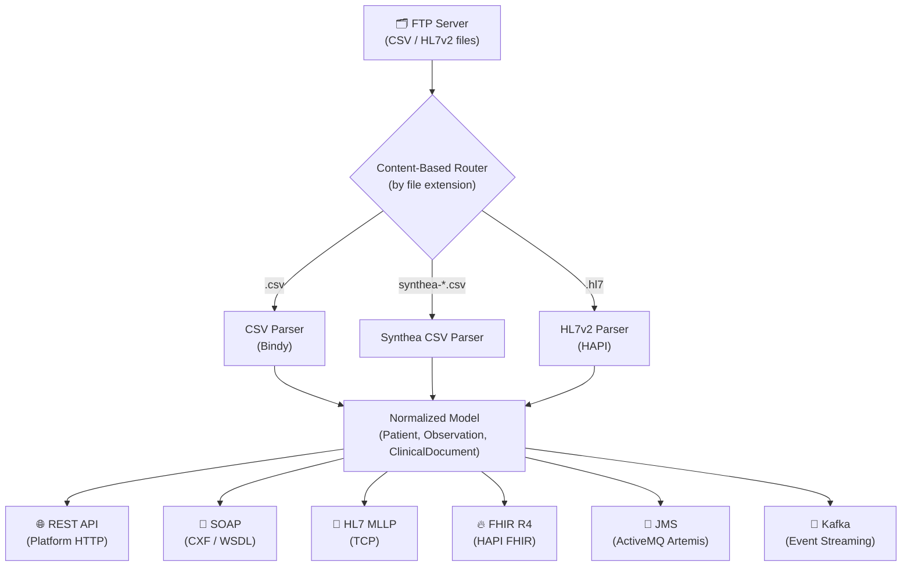
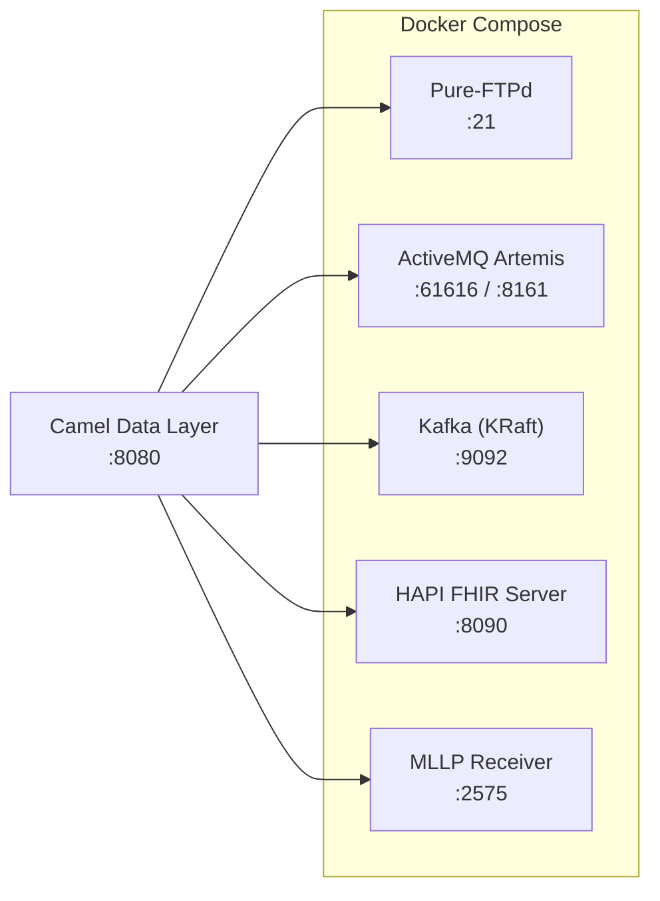
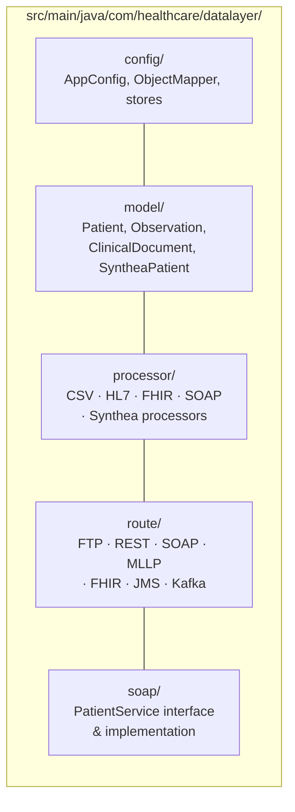

# Camel Data Layer — Healthcare Flat-File Integration Hub

A Java 21 / Quarkus project using Apache Camel to ingest flat files (CSV, HL7v2) from an FTP server and route them to multiple healthcare-standard output connectors.

## Architecture



## Infrastructure



## Output Connectors

| Connector | Protocol | Endpoint |
|-----------|----------|----------|
| REST API | HTTP/JSON | `GET /api/patients`, `GET /api/observations`, `GET /api/health` |
| SOAP | XML/WSDL | `/soap/PatientService` — `getPatient`, `searchPatients`, `getAllPatients` |
| HL7 MLLP | TCP | Outbound HL7v2 messages to `mllp://host:2575` |
| FHIR R4 | HTTP/JSON | POST FHIR Bundle to HAPI FHIR Server |
| JMS | AMQP | `queue.patients`, `topic.clinical-events` on ActiveMQ Artemis |
| Kafka | TCP | `healthcare.patients.ingested` topic |

## Prerequisites

- Java 21+
- Maven 3.9+
- Docker & Docker Compose (for infrastructure)

## Quick Start

### 1. Start infrastructure

```bash
docker-compose up -d
```

This starts:
- **FTP Server** (Pure-FTPd) on port 21
- **ActiveMQ Artemis** on port 61616 (console: http://localhost:8161)
- **Kafka** (KRaft) on port 9092
- **HAPI FHIR Server** on port 8090 (UI: http://localhost:8090)
- **MLLP Receiver** (socat) on port 2575

### 2. Generate synthetic data with Synthea

Uses [Synthea](https://github.com/synthetichealth/synthea) to create realistic synthetic patients:

```bash
chmod +x scripts/*.sh

# Generate 20 patients (default)
./scripts/generate-synthea-data.sh

# Or generate 100 patients in Texas
./scripts/generate-synthea-data.sh 100 Texas
```

This downloads Synthea, generates CSV/HL7/FHIR data, and places it in `sample-data/`.

### 3. Build & run the application

```bash
mvn quarkus:dev
```

### 4. Seed the FTP server with data

```bash
# Upload Synthea-generated files
./scripts/seed-ftp.sh

# Or upload individual files manually
curl -T sample-data/csv/patients.csv ftp://localhost/inbox/ --user healthcare:healthcare123
curl -T sample-data/hl7/adt-a01.hl7 ftp://localhost/inbox/ --user healthcare:healthcare123
```

Data flows through the pipeline only when files are uploaded to the FTP `inbox/` directory. Once a file is ingested, it is parsed and fanned out to all output connectors in parallel.

## Testing the Output Connectors

Start the full stack, run the app, and upload a file to trigger the pipeline:

```bash
docker-compose up -d
mvn quarkus:dev

# Upload a CSV file — triggers all connectors in parallel
curl -T sample-data/csv/patients.csv ftp://localhost/inbox/ --user healthcare:healthcare123
```

### REST API

```bash
# Health check — shows counts for all in-memory stores
curl -s http://localhost:8080/api/health | python3 -m json.tool

# List all patients
curl -s http://localhost:8080/api/patients | python3 -m json.tool

# Get a single patient by ID
curl -s http://localhost:8080/api/patients/P001 | python3 -m json.tool

# Patient not found → 404
curl -s -w "\nHTTP %{http_code}\n" http://localhost:8080/api/patients/UNKNOWN

# List ingested documents
curl -s http://localhost:8080/api/documents | python3 -m json.tool

# OpenAPI spec
curl -s http://localhost:8080/api/openapi | python3 -m json.tool | head -20
```

### SOAP (CXF)

```bash
# Fetch the auto-generated WSDL
curl -s http://localhost:8080/soap/PatientService?wsdl

# Call getPatient
curl -s -X POST http://localhost:8080/soap/PatientService \
  -H "Content-Type: text/xml" \
  -d '<soapenv:Envelope xmlns:soapenv="http://schemas.xmlsoap.org/soap/envelope/"
        xmlns:soap="http://healthcare.com/datalayer/soap">
    <soapenv:Body>
      <soap:getPatient>
        <patientId>P001</patientId>
      </soap:getPatient>
    </soapenv:Body>
  </soapenv:Envelope>'

# Call getAllPatients
curl -s -X POST http://localhost:8080/soap/PatientService \
  -H "Content-Type: text/xml" \
  -d '<soapenv:Envelope xmlns:soapenv="http://schemas.xmlsoap.org/soap/envelope/"
        xmlns:soap="http://healthcare.com/datalayer/soap">
    <soapenv:Body>
      <soap:getAllPatients/>
    </soapenv:Body>
  </soapenv:Envelope>'

# Call searchPatients by last name
curl -s -X POST http://localhost:8080/soap/PatientService \
  -H "Content-Type: text/xml" \
  -d '<soapenv:Envelope xmlns:soapenv="http://schemas.xmlsoap.org/soap/envelope/"
        xmlns:soap="http://healthcare.com/datalayer/soap">
    <soapenv:Body>
      <soap:searchPatients>
        <lastName>Smith</lastName>
      </soap:searchPatients>
    </soapenv:Body>
  </soapenv:Envelope>'
```

### HL7 MLLP

```bash
# Upload an HL7 file to FTP — it will be parsed and forwarded via MLLP
curl -T sample-data/hl7/adt-a01.hl7 ftp://localhost/inbox/ --user healthcare:healthcare123

# Watch the MLLP receiver output
docker logs -f healthcare-mllp-receiver
```

### FHIR R4

```bash
# Wait for FHIR server to be ready (~30s after docker-compose up)
curl -s http://localhost:8090/fhir/metadata | python3 -m json.tool | head -5

# After uploading a file via FTP, check ingested patients
curl -s http://localhost:8090/fhir/Patient | python3 -m json.tool | head -20

# Browse the FHIR server UI
open http://localhost:8090
```

### JMS / ActiveMQ Artemis

```bash
# Open the Artemis web console
open http://localhost:8161
# Login: artemis / artemis

# After uploading a file via FTP, check for messages:
# 1. Click "Queues" in the left menu
# 2. Look for address "queue.patients" (anycast) and "topic.clinical-events" (multicast)
#
# Queues are auto-created by Artemis on first message delivery.
# If no file has been uploaded via FTP yet, the queues will not appear.
```

### Kafka

```bash
# After uploading a file via FTP, consume messages from the topic
docker exec healthcare-kafka /opt/kafka/bin/kafka-console-consumer.sh \
  --bootstrap-server localhost:9092 \
  --topic healthcare.patients.ingested \
  --from-beginning --max-messages 1
```

## Project Structure



## Configuration

All settings are in `src/main/resources/application.properties`. Key properties:

| Property | Default | Description |
|----------|---------|-------------|
| `ftp.host` | localhost | FTP server hostname |
| `ftp.poll.delay` | 5000 | Polling interval (ms) |
| `mllp.host` / `mllp.port` | localhost:2575 | HL7 MLLP target |
| `fhir.server.url` | http://localhost:8090/fhir | FHIR R4 server |
| `kafka.bootstrap.servers` | localhost:9092 | Kafka brokers |

## Running Tests

```bash
mvn test
```

## Building for Production

### JVM mode

```bash
mvn clean package -DskipTests
```

This produces a fast-jar distribution in `target/quarkus-app/`. Run it with:

```bash
java -jar target/quarkus-app/quarkus-run.jar
```

Override configuration at runtime using environment variables or system properties:

```bash
java \
  -Dftp.host=prod-ftp.example.com \
  -Dquarkus.artemis.url=tcp://activemq.example.com:61616 \
  -Dkafka.bootstrap.servers=kafka.example.com:9092 \
  -Dfhir.server.url=https://fhir.example.com/fhir \
  -jar target/quarkus-app/quarkus-run.jar
```

### Docker

```bash
# Build the image (multi-stage: Maven build → JRE-alpine runtime)
docker build -t camel-healthcare-data-hub .

# Run standalone
docker run -p 8080:8080 camel-healthcare-data-hub

# Run with custom config
docker run -p 8080:8080 \
  -e FTP_HOST=prod-ftp.example.com \
  -e QUARKUS_ARTEMIS_URL=tcp://activemq:61616 \
  -e KAFKA_BOOTSTRAP_SERVERS=kafka:9092 \
  -e FHIR_SERVER_URL=http://fhir:8080/fhir \
  camel-healthcare-data-hub
```

### Docker Compose (full stack)

```bash
# Start infrastructure + app together
docker-compose up -d

# Rebuild after code changes
docker-compose up -d --build
```

## Sample Data

### Hand-crafted (checked in)
- `sample-data/csv/patients.csv` — 10 patient records
- `sample-data/hl7/adt-a01.hl7` — ADT^A01 admission message

### Synthea-generated (gitignored, generated on demand)
- `sample-data/csv/synthea/` — Synthea CSV exports (patients, observations, conditions, etc.)
- `sample-data/fhir/synthea/` — FHIR R4 bundles per patient
- `sample-data/hl7/synthea/` — HL7v2 messages
- `sample-data/ftp-seed/` — Pre-selected files ready for FTP upload

Files prefixed with `synthea-` are auto-detected and parsed using the Synthea CSV schema.

## Camel Connectors In Detail

### Inbound

| Component | Maven Artifact | Description |
|-----------|---------------|-------------|
| [FTP](https://camel.apache.org/components/4.x/ftp-component.html) | `camel-quarkus-ftp` | Polls a remote FTP directory for new files. Supports idempotent consumer (skip already-seen files), `move` to `.done`/`.error` subdirectories, and configurable polling interval. Uses Apache Commons Net under the hood. |

### Parsing

| Component | Maven Artifact | Description |
|-----------|---------------|-------------|
| [Bindy (CSV)](https://camel.apache.org/components/4.x/dataformats/bindy-dataformat.html) | `camel-quarkus-bindy` | Unmarshals delimited flat files (CSV) into annotated Java POJOs using `@CsvRecord` and `@DataField` annotations. Maps column positions to fields with type conversion (dates, numbers). |
| [HL7v2](https://camel.apache.org/components/4.x/dataformats/hl7-dataformat.html) | `camel-quarkus-hl7` | Parses HL7v2 pipe-delimited messages (ADT, ORU, etc.) using the [HAPI](https://hapifhir.github.io/hapi-hl7v2/) library. Converts raw HL7 text into strongly-typed Java objects (`ADT_A01`, `PID`, `MSH` segments). Supports HL7 v2.1–v2.8. |

### Outbound

| Component | Maven Artifact | Description |
|-----------|---------------|-------------|
| [REST DSL](https://camel.apache.org/components/4.x/others/rest.html) | `camel-quarkus-rest` + `camel-quarkus-platform-http` | Defines REST endpoints using Camel's REST DSL. Runs on Quarkus' Vert.x HTTP server via `platform-http`. Includes auto-generated OpenAPI spec at `/api/openapi` via `camel-quarkus-openapi-java`. |
| [CXF (SOAP)](https://quarkiverse.github.io/quarkiverse-docs/quarkus-cxf/dev/) | `quarkus-cxf` | Exposes JAX-WS annotated interfaces as SOAP web services with auto-generated WSDL. Uses Apache CXF on Quarkus. The `PatientService` interface is implemented as a CDI bean and served at `/soap/PatientService`. |
| [MLLP](https://camel.apache.org/components/4.x/mllp-component.html) | `camel-quarkus-mllp` | Sends HL7v2 messages over TCP using the Minimal Lower Layer Protocol — the standard transport for HL7v2 in healthcare. Wraps messages in MLLP framing (start block `0x0B`, end block `0x1C` + `0x0D`). Built on Netty for non-blocking I/O. |
| [FHIR](https://camel.apache.org/components/4.x/fhir-component.html) | `camel-quarkus-fhir` + `hapi-fhir-structures-r4` | Interacts with HL7 FHIR R4 REST servers. This project transforms domain `Patient` objects into FHIR R4 `Patient` resources, bundles them into a FHIR `Bundle` (transaction type), and POSTs them to a HAPI FHIR server. Uses the HAPI FHIR client under the hood. |
| [JMS](https://camel.apache.org/components/4.x/jms-component.html) | `camel-quarkus-jms` + `quarkus-artemis-jms` | Publishes messages to JMS queues and topics on ActiveMQ Artemis. The `quarkus-artemis-jms` extension manages the `ConnectionFactory`. Messages are serialized as JSON. Queues are **auto-created by Artemis** on first delivery — they will not appear in the Artemis console until a file has been ingested via FTP. |
| [Kafka](https://camel.apache.org/components/4.x/kafka-component.html) | `camel-quarkus-kafka` | Publishes messages to Apache Kafka topics. Each ingested document is serialized as JSON and keyed by `documentId`. Topics are auto-created by Kafka's default configuration. |

### Internal Routing

| Component | Maven Artifact | Description |
|-----------|---------------|-------------|
| [Direct](https://camel.apache.org/components/4.x/direct-component.html) | `camel-quarkus-direct` | Synchronous in-memory routing between Camel routes. Used to connect the FTP poller to the parsers and the parsers to the fan-out. |
| [SEDA](https://camel.apache.org/components/4.x/seda-component.html) | `camel-quarkus-seda` | Asynchronous in-memory queue between routes. Used in the fan-out to decouple the output connectors — each connector processes messages independently and in parallel. |
| [Jackson](https://camel.apache.org/components/4.x/dataformats/jackson-dataformat.html) | `camel-quarkus-jackson` | Marshals Java objects to JSON. Configured with `JavaTimeModule` to handle `LocalDate`/`LocalDateTime` serialization. Used in REST, JMS, and Kafka routes. |

## Technology Stack

- **Java 21** + **Quarkus** runtime
- **Apache Camel 4.x** (camel-quarkus extensions)
- **HAPI HL7v2** for HL7 message parsing
- **HAPI FHIR R4** for FHIR resource building
- **Quarkus CXF** for SOAP/WSDL
- **ActiveMQ Artemis** for JMS messaging
- **Apache Kafka** for event streaming
